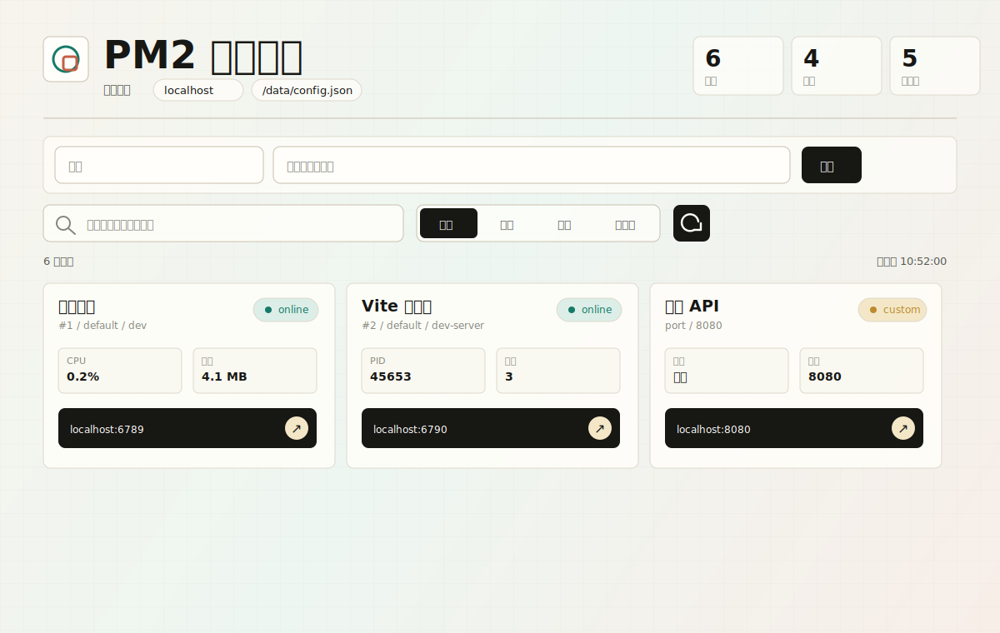

# PM2 服务导航

一个零依赖的 PM2 导航页，默认监听 `0.0.0.0:80`。页面会读取 PM2 服务端口，并根据当前访问的主机生成跳转链接：用 `localhost` 打开就跳 `localhost:端口`，用 IP 打开就跳 `当前IP:端口`。



## 功能

- 自动读取 PM2 进程列表和常见端口配置。
- 兼容 Vite/Vue 这类子进程监听端口，未配置 `PORT` 时会尝试用 `lsof` 检测。
- 支持账号密码登录；配置文件没有账号密码时默认免登录。
- 支持新增自定义导航，填写名称和完整链接或端口即可。
- 支持给 PM2 服务设置别名，不影响真实 PM2 进程名和 PM2 命令。
- 自定义导航、PM2 别名、登录配置都写入本地配置文件，可通过 Docker volume 持久化。

## 启动

```bash
cd /Users/zp29/Downloads/Code/pm2-nav
npm run pm2:start
```

如果 80 端口被占用或没有权限，可以先释放 80 端口、用反向代理转发到本服务，或临时指定高位端口测试：

```bash
NAV_PORT=8080 npm start
```

## 配置文件

原生运行默认配置文件是 `data/config.json`，Docker 默认配置文件是 `/data/config.json`。文件不存在时会按空配置运行；通过页面新增导航或保存别名时会自动创建。

可以从示例复制：

```bash
mkdir -p data
cp config.example.json data/config.json
```

最小配置：

```json
{
  "auth": {
    "username": "",
    "password": ""
  },
  "aliases": {},
  "customLinks": []
}
```

如果 `auth.username` 和 `auth.password` 都为空，就不需要登录。配置后会要求登录：

```json
{
  "auth": {
    "username": "admin",
    "password": "change-me"
  }
}
```

也可以用 `passwordSha256` 替代明文密码：

```json
{
  "auth": {
    "username": "admin",
    "passwordSha256": "你的 sha256 十六进制摘要"
  }
}
```

自定义导航支持完整链接或端口：

```json
{
  "customLinks": [
    {
      "id": "docs",
      "name": "项目文档",
      "url": "https://example.com/docs",
      "port": null
    },
    {
      "id": "api",
      "name": "本地 API",
      "url": null,
      "port": 8080
    }
  ]
}
```

PM2 别名用 `namespace/name` 作为 key，默认 namespace 是 `default`：

```json
{
  "aliases": {
    "default/dev": "前端本地"
  }
}
```

## 端口识别

服务会优先读取 PM2 环境变量里的 `PORT`、`APP_PORT`、`SERVER_PORT`、`VITE_PORT` 等字段，也会兼容 `--port 3000`、`-p 3000` 这类参数。未读到时，会尝试用 `lsof` 从进程监听端口中补充识别。

页面链接会根据当前浏览器访问的主机生成，例如：

- `http://localhost` 打开时跳到 `http://localhost:3000`
- `http://192.168.1.10` 打开时跳到 `http://192.168.1.10:3000`

## Docker

镜像适合 Linux 宿主机使用。由于容器默认看不到宿主机 PM2 进程，需要挂载 PM2_HOME，并共享宿主网络和 PID 命名空间。`/data` 用来保存登录配置、自定义导航和 PM2 别名，只要这个数据目录还在，容器重启或删除重建都不会丢配置。

```bash
docker run -d \
  --name pm2-nav \
  --restart unless-stopped \
  --network host \
  --pid host \
  -e NAV_PORT=80 \
  -e PM2_HOME=/root/.pm2 \
  -e PM2_NAV_CONFIG=/data/config.json \
  -v "$HOME/.pm2:/root/.pm2" \
  -v "$PWD/data:/data" \
  zp29/pm2-nav:latest
```

也可以用 Compose：

```bash
PM2_NAV_IMAGE=zp29/pm2-nav:latest docker compose up -d
```

macOS 的 Docker Desktop 无法直接读取 macOS 宿主进程，建议在 macOS 上继续用 PM2 原生方式运行。

如果要开启 GitHub Actions 自动构建，可以把 `docs/github-actions-docker.yml` 复制到 `.github/workflows/docker.yml`，并在 GitHub 仓库 Secrets 中配置 `DOCKERHUB_USERNAME` 和 `DOCKERHUB_TOKEN`。
