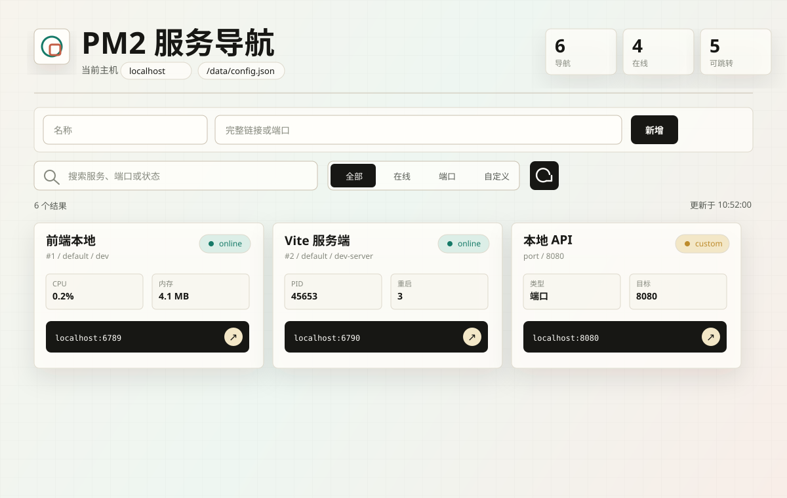

# PM2 服务导航

一个零依赖的 PM2 导航页，默认监听 `0.0.0.0:80`。页面会读取 PM2 服务端口并生成跳转链接：用公网域名打开时跳到当前主机；用 `127.0.0.1` 或局域网 IP 打开时，会同时给出本机 `127.0.0.1` 和每块网卡上的局域网地址。



## 功能

- 自动读取 PM2 进程列表和常见端口配置。
- 兼容 Vite/Vue 这类子进程监听端口，未配置 `PORT` 时会尝试用 `lsof` 检测。
- 支持账号密码登录；配置文件没有账号密码时默认免登录。
- 支持新增自定义导航，填写名称和完整链接或端口即可。
- 支持导入单个静态 HTML 或包含资源的静态站点文件夹。
- 支持给 PM2 服务设置别名，不影响真实 PM2 进程名和 PM2 命令。
- 支持为任意 HTTP 服务创建独立端口的局域网 HTTPS 网关，兼容普通请求与 WebSocket/HMR。
- 自定义导航、PM2 别名、HTTPS 网关和登录配置都写入本地配置文件，可通过 Docker volume 持久化。

## 启动

```bash
cd /Users/zp29/Downloads/Code/pm2-nav
npm run pm2:start
```

如果 80 端口被占用或没有权限，可以先释放 80 端口、用反向代理转发到本服务，或临时指定高位端口测试：

```bash
NAV_PORT=8080 npm start
```

## 配置文件

原生运行默认配置文件是 `data/config.json`，Docker 默认配置文件是 `/data/config.json`。文件不存在时会按空配置运行；通过页面新增导航或保存别名时会自动创建。

可以从示例复制：

```bash
mkdir -p data
cp config.example.json data/config.json
```

最小配置：

```json
{
  "auth": {
    "username": "",
    "password": ""
  },
  "aliases": {},
  "customLinks": [],
  "httpsProxies": []
}
```

如果 `auth.username` 和 `auth.password` 都为空，就不需要登录。配置后会要求登录：

```json
{
  "auth": {
    "username": "admin",
    "password": "change-me"
  }
}
```

也可以用 `passwordSha256` 替代明文密码：

```json
{
  "auth": {
    "username": "admin",
    "passwordSha256": "你的 sha256 十六进制摘要"
  }
}
```

自定义导航支持完整链接或端口：

```json
{
  "customLinks": [
    {
      "id": "docs",
      "name": "项目文档",
      "url": "https://example.com/docs",
      "port": null
    },
    {
      "id": "api",
      "name": "本地 API",
      "url": null,
      "port": 8080
    }
  ]
}
```

PM2 别名用 `namespace/name` 作为 key，默认 namespace 是 `default`：

```json
{
  "aliases": {
    "default/dev": "前端本地"
  }
}
```

## 静态页面导入与持久化

点击页面上的“导入静态页”，可以选择一个 `.html`/`.htm` 文件，或选择一个完整文件夹。文件夹根目录必须包含 `index.html`，其中的 CSS、JavaScript、图片和其他资源会按原目录结构导入。单个 HTML 如果引用了同目录资源，应改为导入整个文件夹。

导入采用复制模式：文件保存在 `data/static-sites/<站点ID>/`，配置元数据写入 `data/config.json`。因此原文件或原文件夹之后移动、改名或删除，不会影响 PM2 Nav 中的页面。需要获取原目录的新版本时，删除旧导航后重新导入。删除静态页面导航会同时删除对应的已导入副本。

站点内的资源链接应使用相对路径（例如 `assets/app.css`），以便从独立站点路径正常加载。静态页面与 PM2 Nav 共用访问域名，请只导入可信内容。

Docker 的 `./data:/data` volume 会同时持久化配置和静态页面。迁移或备份时应复制整个 `data/`，而不只是 `config.json`。默认单次导入上限为 25 MB、1000 个文件，可分别通过 `PM2_NAV_STATIC_IMPORT_LIMIT_BYTES` 和 `PM2_NAV_STATIC_IMPORT_MAX_FILES` 调整；静态文件目录可通过 `PM2_NAV_STATIC_SITES_DIR` 修改。

## 端口识别

服务会优先读取 PM2 环境变量里的 `PORT`、`APP_PORT`、`SERVER_PORT`、`VITE_PORT` 等字段，也会兼容 `--port 3000`、`-p 3000` 这类参数。未读到时，会尝试用 `lsof` 从进程监听端口中补充识别。

页面链接会根据当前浏览器访问的主机生成，例如：

- `http://example.com` 打开时跳到 `http://example.com:3000`
- `http://127.0.0.1` 或局域网 IP 打开时，同一张卡片会显示多个入口：`http://127.0.0.1:3000`，以及本机每一块网卡上的局域网地址，例如 `http://192.168.1.10:3000`

## HTTP 转 HTTPS 网关

在检测到端口的 PM2 服务卡片上点击“启用 HTTPS”，填写：

- 证书 IP / 主机名：局域网设备访问这台机器时使用的地址，例如 `192.168.1.10`。
- HTTPS 端口：新的 HTTPS 监听端口，不能和 HTTP 源端口、PM2 Nav 端口或其他服务端口相同。

保存后，PM2 Nav 会：

1. 在 `data/https` 创建本地 CA 和包含目标 IP/主机名 SAN 的服务证书。
2. 启动 HTTPS 反向代理，把请求转发到该 PM2 服务的 HTTP 端口。
3. 转发 WebSocket 连接，支持 Vite HMR 等开发场景。
4. 把卡片主链接切换到新的 HTTPS 地址。

首次使用时，在弹窗中下载 `pm2-nav-lan-ca.crt`，并在每台需要访问的局域网设备上手动导入和信任。PM2 Nav 不会自动修改操作系统的证书信任设置。请妥善保护 `data/https/lan-ca-key.pem`；它是本地 CA 私钥，不应复制给其他设备或提交到 Git。

可选环境变量：

- `PM2_NAV_HTTPS_DIR`：证书目录，默认是 `$PM2_NAV_DATA_DIR/https`。
- `PM2_NAV_OPENSSL_BIN`：OpenSSL 命令路径，默认是 `openssl`。

## Docker

镜像适合 Linux 宿主机使用。由于容器默认看不到宿主机 PM2 进程，需要挂载 PM2_HOME，并共享宿主网络和 PID 命名空间。`/data` 用来保存登录配置、自定义导航和 PM2 别名，只要这个数据目录还在，容器重启或删除重建都不会丢配置。

```bash
docker run -d \
  --name pm2-nav \
  --restart unless-stopped \
  --network host \
  --pid host \
  -e NAV_PORT=80 \
  -e PM2_HOME=/root/.pm2 \
  -e PM2_NAV_CONFIG=/data/config.json \
  -v "$HOME/.pm2:/root/.pm2" \
  -v "$PWD/data:/data" \
  zp29/pm2-nav:latest
```

也可以用 Compose：

```bash
PM2_NAV_IMAGE=zp29/pm2-nav:latest docker compose up -d
```

macOS 的 Docker Desktop 无法直接读取 macOS 宿主进程，建议在 macOS 上继续用 PM2 原生方式运行。

如果要开启 GitHub Actions 自动构建，可以把 `docs/github-actions-docker.yml` 复制到 `.github/workflows/docker.yml`，并在 GitHub 仓库 Secrets 中配置 `DOCKERHUB_USERNAME` 和 `DOCKERHUB_TOKEN`。
